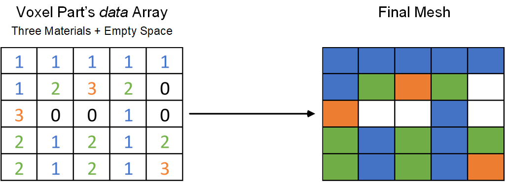

.. _voxel-part:

The Voxel Part
==============

Definition
----------
The voxel part is the main object [1]_ used creating a part.
It describes a cuboid part made of voxels and includes various
properties and methods that can be used to describe and manipulate a part.

TODO: different properties ie name, size, etc.

Underlying Data Structure
-------------------------
The main property (variable) in the *VoxelPart* class is named *data*.
It is a 2D or 3D numpy array which describes a square or cuboid grid of elements.
This means that all elements are rectangular or cuboid in shape, i.e. they are pixels or voxels.
Use of `NumPy <https://numpy.org/>`__ allows us to utilize the package's extremely optimized
numerical facilities and provides compatibility with other useful mathematical libraries.

Materials
---------
Each cell in the *data* array is considered a voxel.
The value of a cell determines the material assigned to that cell.
As such, it must be a non-negative integer and by convention, a value of zero signifies empty space.
This approach means that the model can have as many different materials as possible
within the biggest data type of NumPy's array. Each of these is called a *Material Code*.
While this may give the user freedom in using as many materials as possible, this raises the problem that an array
must have the same data type for all of its elements which can consume a lot of memory.

Practically speaking, most models will not have many elements.
Therefore, when creating the voxel part the *dtype* parameter can be set to specify the data type of the *data* array.
Users are advised to use the smallest data type necessary needs to make computations faster and less memory intensive.
:numref:`material_code_table` shows valid dtype values and their respective ranges and memory consumption.

.. table:: Valid *dtype* values and their respective ranges and memory consumption.
   :name:  material_code_table
   :align: center
   :widths: auto

   +---------------+---------------------+------------------+-----------------------------+
   |               |                     |                  |       Required Memory       |
   | *dtype* Value | Material Code Range | NumPy Equivalent +-------------+---------------+
   |               |                     |                  | One Element | 125M Elements |
   +===============+=====================+==================+=============+===============+
   |    'uint8'    |  0 – 255            |   numpy.uint8    |   1 Byte    |    125  MB    |
   +---------------+---------------------+------------------+-------------+---------------+
   |    'uint16'   |  0 – 65535          |   numpy.uint16   |   2 Bytes   |    250  MB    |
   +---------------+---------------------+------------------+-------------+---------------+
   |    'uint32'   |  0 – 2 :sup:`32`-1  |   numpy.uint32   |   4 Bytes   |    500  MB    |
   +---------------+---------------------+------------------+-------------+---------------+
   |    'uint64'   |  0 – 2 :sup:`64`-1  |   numpy.uint64   |   8 Bytes   |    1000 MB    |
   +---------------+---------------------+------------------+-------------+---------------+

When outputting the model, the materials to be output will be selected and only those materials
will be written to the output file (which is currently an Abaqus™ *.inp* file).
For each *material code*, an Abaqus element set is created which can be used for assigning materials properties.
Any material code not requested for output will have its element not written to the output.
This is typically elements with a material code of zero, but can be any material code that the user desires.
A sample transformation between the *data* array and finite element mesh is shown in :numref:`voxelpart-data-to-mesh`.

         and empty space and the resulting mesh. White cells signify empty space.

   The *data* variable for a 5×5 model containing three different materials
   and empty space and the resulting mesh. White cells signify empty space.

Model Manipulation
------------------
Upon creation, one material code is assigned to all elements in the model.
*Model Manipulation* refers to the methods using which the part's *data* array is changed to obtain the desired model.
There are three (TODO) methods for manipulating a model:

+ Manual changing of the values in the *data* array.
  This can be as simple as changing the value of individual elements, or as complex as the user desires.
  The *data* array is a NumPy array and any valid change that does not change its *dtype* is permitted.
  Example X shows this method in practice. (TODO)
+ Use of boolean masks for manipulating a model.
  This is a simple and effective method which is covered in TODO.

.. [1] *Object* is a concept used in the Object Oriented Programming paradigm.
       Users may find knowledge of the basic concepts useful. Programmers wishing to extend
       the library will definitely need some experience with OOP.
